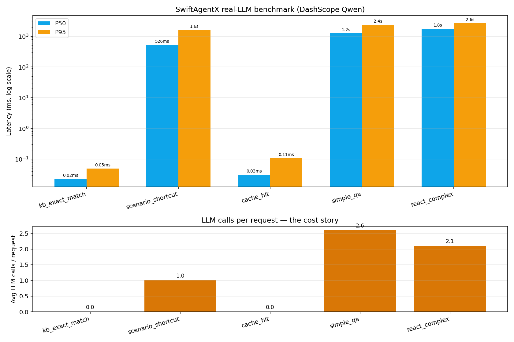
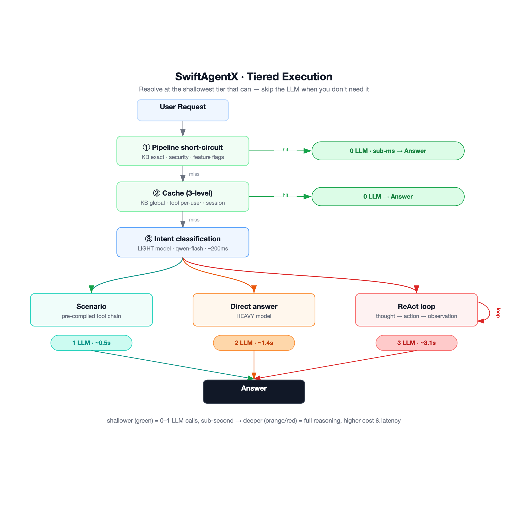

# SwiftAgentX

**A production Agent framework that turns repeated Agent reasoning into
reusable, low-latency *Scenario chains*.**

[](https://pypi.org/project/swiftagentx/)
[](https://pypi.org/project/swiftagentx/)
[](LICENSE)
[](https://github.com/Caxson/swiftagentx/actions/workflows/ci.yml)
[](https://pypi.org/project/swiftagentx/)

[English](#english) | [中文](#中文)

---

<a id="english"></a>

## The core idea: Dynamic Scenario chains

Other frameworks make every request pay the reasoning tax again. SwiftAgentX
treats ReAct as exploration, not the final runtime path. In production,
**80% of traffic is predictable**: "check my order status", "what's your
return policy", "book a slot at 3pm". Once a pattern proves repeatable, it
should become a reusable chain: cheaper, faster, and more deterministic.

A **Scenario** is the runtime form of that chain: a *pre-compiled execution
path* that can be written by a developer or promoted from an AI-generated
plan:

```python
agent.register_scenario("order_status", ScenarioConfig(
    name="Order Status",
    triggers=["order", "where is my", "shipment"],
    tool_chain=[
        ToolChainStep(tool="order_db", query_template="$order_id"),
        ToolChainStep(tool="courier_api", condition="status=in_transit"),
    ],
    cache_ttl=120,
    output_type="direct",   # no second LLM call to "format" the answer
))
```

When the LIGHT model classifies a request as a `weather` / `order_status` /
`balance_check` scenario, SwiftAgentX **executes the chain directly** —
no ReAct loop, no second LLM call. One classification step (LIGHT model),
one tool chain, done.

The v0.4 Planner closes the loop for requests that are not Scenario-ready
yet:

1. A REACT-level request can spend one LIGHT-model call to generate a
   templated tool chain.
2. The chain runs through the same deterministic engine that executes
   Scenarios.
3. Successful plans become reviewable candidates.
4. A developer can approve reuse, then promote the plan into a real Scenario
   (or enable rule-based auto gates).
5. Future matching requests take the Scenario shortcut.

That is the framework's biggest design bet: **the Agent gets faster the more
it runs**, because repeated reasoning can graduate into reusable Scenario
chains instead of paying the full ReAct cost forever.

## Tiered execution

Scenarios sit in the middle of a four-tier execution model. **All numbers
below are measured against DashScope Qwen — 20 iterations per scenario,
LIGHT=`qwen-flash`, HEAVY=`qwen-turbo` (v0.3.3). Reproducible from this
repo with one command** (see [`benchmarks/`](benchmarks/)).



| Request type | Path | P50 latency | P95 | LLM calls |
|---|---|---:|---:|---:|
| KB exact match / cache hit | Pipeline short-circuit | **0.02 ms** | 0.1 ms | **0** |
| **Known intent (Scenario)** | **Pre-compiled tool chain** | **526 ms** | 1.6 s | **1** (LIGHT only) |
| Open conversation | Direct LLM | 1.2 s | 2.4 s | 2–3 |
| Multi-step reasoning | Full ReAct loop | 1.8 s | 2.6 s | 2–3 |

<sub>Measured 2026-05-29 on swiftagentx 0.3.3, 20 iterations/scenario. The
two cheap tiers (cache + scenario) cost **0–1 LLM calls** — that's the
headline. The ReAct dedup guard keeps multi-step loops short, so even the
deepest tier rarely pays for more than 2–3 calls.</sub>

A LIGHT model picks the path. A HEAVY model only runs when the request
genuinely needs open-ended reasoning. The two cheap tiers (cache + scenario)
together cover the predictable bulk of production traffic at **0–1 LLM
calls per request** — that's the headline. Reproduce the numbers with:

```bash
git clone https://github.com/Caxson/swiftagentx.git
cd swiftagentx
pip install -e ".[dev,openai,benchmark]"
export DASHSCOPE_API_KEY=sk-...
python benchmarks/real_runner.py --iterations 30
```

### What goes inside a Scenario chain

A Scenario chain is not just a static tool list. Steps can be:

- A native Python `Tool`
- (v0.3+) An **MCP** tool — any
  [Model Context Protocol](https://modelcontextprotocol.io) server's exposed
  tools, no Python wrapper required
- (v0.3+) A **hook** — a conditional handler that branches into an LLM
  call, a sub-agent dispatch, or external shell logic when the chain hits
  a particular state

This is how Scenario chains stay fast *and* extensible: the routing decision
is cheap, but each step can reach into the full agent toolkit when needed.

### vs. LangChain / AutoGen / CrewAI

|  | SwiftAgentX | LangChain | AutoGen | CrewAI |
|---|:---:|:---:|:---:|:---:|
| **AI-generated chains can graduate into Scenarios** | **✅ core differentiator** | ❌ no equivalent | ❌ no equivalent | ❌ no equivalent |
| **Pre-compiled Scenario shortcut** | ✅ | ❌ no equivalent | ❌ no equivalent | ❌ no equivalent |
| FAQ / cache-hit returns with 0 LLM calls | ✅ | 1-3 LLM calls | 2+ LLM calls | 2+ LLM calls |
| Built-in three-level cache (KB / tool / session) | ✅ | partial | ❌ | ❌ |
| Dual-model routing (LIGHT/HEAVY) baked in | ✅ | DIY | DIY | DIY |
| Pipeline stage short-circuit (KB / security / feature flags) | ✅ | DIY | ❌ | ❌ |
| Streaming with fine-grained event types | ✅ 12 types | ✅ | partial | ✅ |
| Framework-agnostic core (no HTTP in `core/`) | ✅ | n/a | n/a | n/a |
| Test suite size | 274 tests, **~1 s locally** | huge | huge | medium |

LangChain is broader. SwiftAgentX is sharper for the predictable-traffic
production patterns where latency and per-request LLM cost actually move
the needle.

## Who is this for

- You ship an Agent product where **most requests are predictable** (customer
  service, order ops, FAQ, internal copilots, AI outbound) and only a small
  tail needs real open-ended reasoning.
- You want repeatable requests to **turn into reviewed runtime assets**,
  instead of paying the same multi-step reasoning cost forever.
- You care about **P95 latency and per-request LLM cost** as first-class
  metrics, not afterthoughts.
- You want a framework compact enough to **read in one afternoon** (~9k
  lines of source)
  and modify without fear.
- You're comfortable wiring tools, KBs, and scenarios in Python instead of
  YAML/DSL.

If you want a kitchen-sink toolkit with every integration imaginable, use
LangChain. If you want a small, fast, opinionated core where Scenarios are
the unit of design, read on.

## Features

| | Feature | What it does |
|:--:|---|---|
| 🔁 | **Dynamic Scenario chains** | One LIGHT call can generate a templated tool chain for a REACT-level request; successful chains become reviewable candidates and can graduate into Scenarios. |
| 🎯 | **Scenarios** | Pre-compiled execution paths that skip the ReAct loop on known intents — the runtime destination for stable chains. Each step is a Python tool, an MCP tool, or a conditional hook. |
| 🪜 | **Tiered execution** | Pipeline short-circuit → Scenario → ReAct → Direct, picked per request by a LIGHT classifier. |
| 🧭 | **Planner fast path** (v0.4) | One LIGHT call plans a REACT request's whole tool chain up front; the chain runs deterministically, failures fall back to ReAct. Successful plans graduate into Scenarios through two human-gated steps (approve reuse → promote). |
| 🔍 | **Scenario prefilter** (v0.4) | Classifier prompt stays O(K) as the scenario pool grows: retrieval picks top-K candidates per request. Zero-dep lexical default, pluggable `EmbeddingRetriever` for semantic matching. |
| ⚖️ | **Dual-model routing** | `ModelTier.LIGHT` for classification, `ModelTier.HEAVY` for reasoning — ~30× cost spread on real providers. |
| ⚡ | **Three-level cache** | KB exact match (global), tool result (per-user), session variables. Independent TTLs, periodic cleanup. |
| 🚦 | **Pipeline stages** | KB short-circuit, security checks, feature flags, or any custom logic before cache/route. Stages CONTINUE, SHORT_CIRCUIT, or ABORT. |
| 📚 | **Knowledge base ABC** | Built-in TF-IDF `MemoryKnowledgeBase` for local dev; bring your own (Weaviate, Elasticsearch, pgvector) via a 3-method ABC. |
| 📡 | **SSE streaming** | 12 event types (`THINKING`, `ACTION`, `OBSERVATION`, `ANSWER`, …) with heartbeats. |
| 🛠️ | **Admin API** | Status, tools, cache, config, KB endpoints as a Flask blueprint *and* a FastAPI router. Framework-agnostic core. |
| 🧅 | **Middleware pipeline** | Tracing, retries, input validation, error sanitization. Hook into any stage. |
| 🪶 | **No HTTP in core** | `httpx` is optional — run SwiftAgentX in a Lambda, a Celery worker, or a notebook. |

## Current v0.4 building blocks

SwiftAgentX 0.4.x includes the 2026-era building blocks that make dynamic
Scenario chains practical:

- **MCP server support** — Scenarios and ReAct can use tools from any MCP
  server. One-line registration.
- **4-layer Memory** — Current question / last-4-turns verbatim /
  reference window / incremental rolling summary. Topic-change detection
  triggers re-summarization.
- **Hook system** — Lifecycle hooks (pre/post tool, pre/post classify) and
  semantic hooks (topic change, scenario step conditional).
- **Sub-agent dispatch** — From inside ReAct or a Scenario step, spawn a
  focused sub-agent with isolated context. Parallel dispatch supported.
- **Skill-in-ReAct** — Markdown-defined workflows the ReAct loop can pull in
  on demand (different from Scenarios, which are pre-compiled and fast).
  `Agent.load_agent_skills(dir)` loads Anthropic Agent Skills packages
  (`SKILL.md` + resource files) directly, so ecosystem skill packs work
  without conversion.
- **Worktree-style workspace** — File sandbox per session for agents that
  generate documents.
- **Cache-friendly prompt order** — Anthropic / OpenAI prompt cache
  optimization wired into the framework.
- **Lazy tool loading** — When a registry grows past a threshold, LIGHT
  model picks the relevant category before HEAVY sees schemas.

## Installation

```bash
pip install swiftagentx
```

With optional dependencies:

```bash
pip install swiftagentx[openai]     # httpx for async OpenAI-compatible calls
pip install swiftagentx[flask]      # Flask SSE adapter
pip install swiftagentx[fastapi]    # FastAPI SSE adapter
pip install swiftagentx[all]        # Everything
```

## Quick Start

### Minimal Example

```python
import asyncio
from swiftagentx import Agent, DummyModelClient

async def main():
    agent = Agent(model=DummyModelClient(api_key="test", model="dummy"))
    response = await agent.run("Hello!")
    print(response.answer)

asyncio.run(main())
```

### With OpenAI-Compatible API

> Needs `pip install "swiftagentx[openai]"` (brings in httpx + SOCKS support).
> Inside mainland China, also prepend `HTTP_PROXY= HTTPS_PROXY= ALL_PROXY=`
> when calling China-based endpoints (Aliyun DashScope, etc.) so httpx
> doesn't try to tunnel through your foreign proxy.

```python
import os, asyncio
from swiftagentx import Agent
from swiftagentx.providers.openai_compatible import OpenAICompatibleProvider

async def main():
    agent = Agent(
        # OpenAI:
        # model=OpenAICompatibleProvider(
        #     api_key=os.environ["OPENAI_API_KEY"], model="gpt-4o",
        #     api_base="https://api.openai.com/v1",
        # ),
        # Aliyun DashScope (Qwen — what the benchmarks above use).
        # Disabling hybrid thinking matters: it halves classification
        # latency (~1000ms -> ~450ms measured) with identical output.
        model=OpenAICompatibleProvider(
            api_key=os.environ["DASHSCOPE_API_KEY"],
            model="qwen3.6-flash",
            api_base="https://dashscope.aliyuncs.com/compatible-mode/v1",
            extra_params={"enable_thinking": False},
        ),
        # DeepSeek:
        # model=OpenAICompatibleProvider(
        #     api_key=os.environ["DEEPSEEK_API_KEY"], model="deepseek-chat",
        #     api_base="https://api.deepseek.com/v1",
        # ),
    )
    # `session_id` is optional: a single Agent instance shares one default
    # session across calls, so a simple CLI bot has memory out of the box.
    # Multi-user servers should pass an explicit session_id per user.
    response = await agent.run("Explain quantum computing in one sentence.")
    print(response.answer)

asyncio.run(main())
```

Works with any OpenAI-compatible endpoint — OpenAI, Azure OpenAI, DeepSeek,
DashScope, Together, Fireworks, etc. Pick the snippet that matches your
provider and set the matching env var.

### Multi-turn conversations

`Agent.run(text)` accepts `session_id=` and `user_id=` keyword arguments.
Every turn that shares the same `session_id` shares one `LayeredMemory`
(L1 current / L2 last 4 turns verbatim / L3 reference / L4 rolling summary).
Without a `session_id`, the agent uses one stable default session id
generated at construction time — so a simple CLI chatbot with a single
`Agent` instance "just works":

```python
agent = Agent(model=OpenAICompatibleProvider(...))
while user_input := input("You: "):
    response = await agent.run(user_input)   # default session shared across turns
    print("Bot:", response.answer)
```

For a multi-user server, pass an explicit `session_id` per user instead.

### Custom Tools

```python
import asyncio

from swiftagentx import Agent, Tool, ToolOutput, DummyModelClient

class WeatherTool(Tool):
    def __init__(self):
        super().__init__(name="weather", description="Get weather for a city")

    async def execute(self, context, **kwargs):
        city = kwargs.get("city", "unknown")
        return ToolOutput(success=True, result=f"Sunny, 25C in {city}")

async def main():
    agent = Agent(model=DummyModelClient(api_key="test", model="dummy"))
    agent.register_tool(WeatherTool())
    response = await agent.run("What's the weather in Beijing?")
    print(response.answer)

asyncio.run(main())
```

### Dual-Model Strategy

Use a fast, cheap model for intent classification and a powerful model for reasoning:

```python
from swiftagentx import Agent, ModelTier
from swiftagentx.providers.openai_compatible import OpenAICompatibleProvider

light = OpenAICompatibleProvider(api_key=key, model="gpt-3.5-turbo", api_base=base)
heavy = OpenAICompatibleProvider(api_key=key, model="gpt-4", api_base=base)

agent = Agent(
    models={
        ModelTier.LIGHT: light,   # Intent classification (~200ms)
        ModelTier.HEAVY: heavy,   # ReAct reasoning & response generation
    },
)
```

### Scenario Toolchains

Skip the ReAct loop for common request patterns. This example is fully
copy-paste runnable without a real API key:

```python
import asyncio

from swiftagentx import (
    Agent,
    DummyModelClient,
    ModelResponse,
    ScenarioConfig,
    SwiftAgentConfig,
    Tool,
    ToolChainStep,
    ToolOutput,
)

class RouterModel(DummyModelClient):
    async def chat(self, messages, **kwargs):
        prompt = messages[-1]["content"]
        if "Classify the user" in prompt:
            return ModelResponse(
                content='level=2 scenario=weather slots={"city": "Beijing"}',
                model=self.model,
            )
        return await super().chat(messages, **kwargs)

class WeatherTool(Tool):
    def __init__(self):
        super().__init__(name="weather", description="Get weather for a city")

    async def execute(self, context, **kwargs):
        city = kwargs.get("city", "unknown")
        return ToolOutput(success=True, result=f"Sunny, 25C in {city}")

async def main():
    agent = Agent(
        model=RouterModel(api_key="test", model="router"),
        config=SwiftAgentConfig(
            enable_cache=False,
            memory_enable_topic_change_hook=False,
        ),
    )
    agent.register_tool(WeatherTool())
    agent.register_scenario("weather", ScenarioConfig(
        name="Weather Query",
        description="Get weather information for a city",
        triggers=["weather", "temperature", "forecast"],
        tool_chain=[
            ToolChainStep(tool="weather", kwargs_template={"city": "$city"}),
        ],
        cache_ttl=1800,
        output_type="direct",
    ))

    response = await agent.run("What's the weather in Beijing?")
    print(response.answer)  # Sunny, 25C in Beijing

asyncio.run(main())
```

When the light model classifies a request as a "weather" scenario, the framework executes the tool chain directly — no ReAct loop, no extra LLM calls.

### Planner Fast Path: Plans That Graduate into Scenarios (v0.4)

For REACT-level requests, one LIGHT-model call can plan the whole tool
chain up front; the chain then runs deterministically through the same
engine that executes Scenarios. Any failure — unplannable request, invalid
plan, step error — falls back to the normal ReAct loop, so the fast path
can only make requests faster, never wronger.

```python
from swiftagentx import Agent, SwiftAgentConfig

agent = Agent(model=..., config=SwiftAgentConfig(enable_planner=True))

# A successful plan's afterlife has two gates — both MANUAL by default,
# so the framework never persists LLM-generated behavior behind your back:
for plan in agent.list_plan_candidates():    # review candidates + stats
    agent.approve_plan(plan["plan_id"])      # gate 1: allow reuse on later requests
    agent.promote_plan(plan["plan_id"])      # gate 2: register as a real Scenario

# ...or let rules run both gates:
# SwiftAgentConfig(enable_planner=True, plan_auto_reuse=True,
#                  plan_auto_promote=True, plan_promote_after=3)
```

Measured on DashScope `qwen3.6-flash` (full-auto mode): the same intent
across three phrasings ran **2.3 s / 3 LLM calls** (fresh plan) →
**1.6 s / 3** (cached reuse) → **1.3 s / 2** (promoted, routed as a
Scenario). The agent gets faster the more it runs — and Scenarios stay
the destination: the Planner is their auto-miner, not their replacement.

### Scenario Prefilter at Scale (v0.4)

Above `scenario_prefilter_top_k` (default 8) registered scenarios, the
router ranks the pool against the input and shows the classifier only the
top-K candidates — classification accuracy and prompt size stay constant
as the pool grows to hundreds of scenarios. The default retriever is
lexical (zero dependencies, CJK-aware); plug in embeddings for semantic
matching that catches phrasings with no shared keywords:

```python
from swiftagentx import Agent, EmbeddingRetriever
from swiftagentx.providers.embedding import OpenAICompatibleEmbeddingProvider

embedder = OpenAICompatibleEmbeddingProvider(
    api_key=..., model="text-embedding-v4",
    api_base="https://dashscope.aliyuncs.com/compatible-mode/v1",
)
agent = Agent(model=..., scenario_retriever=EmbeddingRetriever(embedder))
```

Scenario vectors are embedded once and cached — each request costs one
query embedding, and any embedding failure falls back to lexical ranking
instead of breaking classification.

### SSE Streaming

```python
from swiftagentx import Agent, AgentRequest, SSEStreamAdapter, DummyModelClient

async def main():
    agent = Agent(model=DummyModelClient(api_key="test", model="dummy"))
    request = AgentRequest(user_id="u1", session_id="s1", user_input="Hello")
    adapter = SSEStreamAdapter()

    response = await agent.run_stream(request, adapter)

    # Events are available via adapter.event_generator()
    # In a web context, pipe this to an SSE response
```

### Knowledge Base

Attach a knowledge base to your agent. Exact matches are returned instantly, skipping LLM processing entirely:

```python
from swiftagentx import Agent, DummyModelClient, MemoryKnowledgeBase, Document

async def main():
    agent = Agent(model=DummyModelClient(api_key="test", model="dummy"))

    kb = MemoryKnowledgeBase()
    await kb.add_documents([
        Document(doc_id="faq-1", content="Return policy: 7-day no-questions-asked returns"),
        Document(doc_id="faq-2", content="Points can be redeemed in the member store"),
    ])
    agent.set_knowledge_base(kb)  # Auto-registers KnowledgeBaseTool

    response = await agent.run("Return policy: 7-day no-questions-asked returns")
    # → Exact match (score=1.0), returned directly without LLM call
```

Use `KnowledgeBaseStage` in the pipeline for pre-processing short-circuit:

```python
from swiftagentx import KnowledgeBaseStage

agent.pipeline.add_stage(KnowledgeBaseStage(kb=kb, threshold=0.95))
```

Implement the `KnowledgeBase` ABC to integrate with Weaviate, Elasticsearch, or any vector store. See [Knowledge Base Guide](docs/guide/knowledge-base.md).

### Admin API

Monitor and manage your agent at runtime:

```python
from swiftagentx.admin import AdminService, create_flask_admin_blueprint

service = AdminService(agent)

# Flask
bp = create_flask_admin_blueprint(service)
app.register_blueprint(bp, url_prefix="/admin")

# FastAPI
from swiftagentx.admin import create_fastapi_admin_router
router = create_fastapi_admin_router(service)
app.include_router(router, prefix="/admin")
```

Available endpoints:

| Method | Path | Description |
|---|---|---|
| GET | `/admin/status` | Agent status, tool count, cache stats, uptime |
| GET | `/admin/tools` | Registered tools with JSON Schema |
| GET | `/admin/cache/stats` | Cache hit statistics |
| POST | `/admin/cache/clear` | Clear cache (all or by level) |
| GET | `/admin/config` | Current config (secrets masked) |
| PUT | `/admin/config` | Update config at runtime |
| POST | `/admin/kb/search` | Search knowledge base |
| POST | `/admin/kb/documents` | Add documents |
| DELETE | `/admin/kb/documents/:id` | Delete a document |
| GET | `/admin/kb/stats` | KB document count and provider |

> **Security**: Admin endpoints have no built-in authentication. Add your own middleware in production. See [Admin Guide](docs/guide/admin.md).

### Flask Integration

```python
from flask import Flask
from swiftagentx import Agent, DummyModelClient
from swiftagentx.web.flask_adapter import create_flask_blueprint

app = Flask(__name__)
agent = Agent(model=DummyModelClient(api_key="test", model="dummy"))
app.register_blueprint(create_flask_blueprint(agent))
# POST /api/v1/agent/sse  — SSE streaming endpoint
# GET  /api/v1/agent/health — Health check
```

### FastAPI Integration

```python
from fastapi import FastAPI
from swiftagentx import Agent, DummyModelClient
from swiftagentx.web.fastapi_adapter import create_fastapi_router

app = FastAPI()
agent = Agent(model=DummyModelClient(api_key="test", model="dummy"))
app.include_router(create_fastapi_router(agent))
```

### Lifecycle Hooks

Two ways to hook into the request lifecycle.

**A. Subclass `Agent` and override** — simplest for project-local logic:

```python
from swiftagentx import Agent

class MyAgent(Agent):
    async def on_request_start(self, context): ...           # request received
    async def on_before_classify(self, context): ...          # before intent classification
    async def on_after_classify(self, context, intent): ...   # after intent classification
    async def on_before_tool_call(self, context, tool_name, params): ...
    async def on_after_tool_call(self, context, tool_name, result): ...
    async def on_before_respond(self, context, answer):       # may rewrite answer
        return answer
    async def on_request_end(self, context, response): ...    # request finished
```

Each override is optional; the framework calls the base no-op when you
don't override.

**B. `HookRegistry` — declarative, no subclassing** (v0.3+):

```python
from swiftagentx import HookEvent, HookResult, PythonHook

async def log_tool(ctx):
    print(f"tool {ctx.tool_name}({ctx.tool_args}) → {ctx.tool_result}")
    return HookResult()

agent.hooks.register(PythonHook(
    name="log_tools", events={HookEvent.AFTER_TOOL_CALL}, handler=log_tool,
))
```

Twelve lifecycle events are dispatched: `SESSION_START`, `REQUEST_START`,
`BEFORE_CLASSIFY`, `AFTER_CLASSIFY`, `BEFORE_SCENARIO_STEP`,
`AFTER_SCENARIO_STEP`, `BEFORE_TOOL_CALL`, `AFTER_TOOL_CALL`,
`BEFORE_REACT_ITER`, `AFTER_REACT_ITER`, `BEFORE_RESPOND`, `REQUEST_END`
— plus semantic events like `TOPIC_CHANGE`. Handlers can return
`HookResult(action="short_circuit", answer=...)` to bypass the rest of
the request (useful for security policies / rate limiters / quota checks).

Both styles coexist and fire at the same boundary — subclass methods
first, then registered hooks.

### Middleware

```python
from swiftagentx import Agent, Middleware, DummyModelClient

class LoggingMiddleware(Middleware):
    async def process(self, context, next_handler):
        print(f"[LOG] Processing: {context.get('user_input', '')}")
        result = await next_handler(context)
        print(f"[LOG] Done")
        return result

agent = Agent(model=DummyModelClient(api_key="test", model="dummy"))
agent.use(LoggingMiddleware())
```

### Configuration

```python
from swiftagentx import Agent, SwiftAgentConfig, DummyModelClient

agent = Agent(
    model=DummyModelClient(api_key="test", model="dummy"),
    config=SwiftAgentConfig(
        name="MyAgent",
        max_iterations=5,
        enable_cache=True,
        max_input_length=5000,
        debug=False,               # Set True to expose error details
        sse_heartbeat_interval=5.0,
        max_cache_entries_per_level=10000,
    ),
)
```

## Architecture



A request descends through the tiers and **stops at the shallowest one that
can answer it** — cache and KB hits return with zero LLM calls, known intents
fire a pre-compiled Scenario for one, and only genuinely open-ended requests
pay for the full ReAct loop.

<details>
<summary>Full execution pipeline (text)</summary>

```
User Request
    |
    v
[Middleware Chain] ──> TracingMiddleware, custom middleware, ...
    |
    v
[Pipeline Stages]
    ├─ [KnowledgeBaseStage] ─── exact match? ──> SHORT_CIRCUIT (return directly)
    ├─ [Custom Stages] ─── security check, feature flags, ...
    |
    v
[Input Validation] ─── too long? ──> Reject
    |
    v
[Cache Check] ─── hit? ──> Return cached answer (0ms)
    |
    v
[Scenario Prefilter] ─── pool > top_k? retrieval keeps top-K candidates (lexical / embedding)
    |
    v
[Intent Classification] (Light Model, ~200ms)
    |
    ├─ SCENARIO ──> Scenario Toolchain ──> Direct / LLM-formatted response
    ├─ REACT ────> Planner fast path (opt-in): plan once ──> deterministic chain
    │                 └─ invalid plan / step failure ──> ReAct Loop (Heavy Model)
    └─ DIRECT ───> Direct LLM Response (Heavy Model)
    |
    v
[Lifecycle Hooks] ──> on_before_respond
    |
    v
[SSE Stream / Response]
```

</details>

### Three-Level Cache

| Level | Scope | Key | TTL | Use Case |
|---|---|---|---|---|
| L1 - KB | Global | Query hash | Configurable (default 1h) | Knowledge base exact match |
| L2 - Code | Per-user + platform | User + platform + query hash | Configurable (default 5m) | Tool execution results |
| L3 - Dynamic | Per-session | Variable name | No expiry | Session state variables |
| Scenario | Per-scenario | Custom template | Configurable | Toolchain results |

## Package Structure

```
swiftagentx/
├── core/            # Agent, memory, model client, cache, prompt, router, planner, retrieval, pipeline
├── models/          # Pydantic schemas (AgentRequest, AgentResponse, config)
├── tools/           # Tool base class, registry, executor, termination checker, scenario engine
├── knowledge_base/  # KnowledgeBase ABC, MemoryKB (TF-IDF), KnowledgeBaseTool, KnowledgeBaseStage
├── admin/           # AdminService, Flask Blueprint, FastAPI Router
├── stream/          # SSE adapter and event builder
├── providers/       # LLM providers (OpenAI-compatible chat + embeddings, DummyModelClient)
├── storage/         # Storage backend abstraction (memory, extensible)
├── middleware/       # Middleware chain (tracing, custom)
└── web/             # Web framework adapters (Flask, FastAPI)
```

## Documentation

| Document | Description |
|---|---|
| [Architecture](docs/architecture.md) | System overview, dual-model strategy, cache, pipeline, ReAct loop |
| [Tools Guide](docs/guide/tools.md) | Custom tool development |
| [Scenarios Guide](docs/guide/scenarios.md) | Scenario toolchain configuration |
| [Knowledge Base Guide](docs/guide/knowledge-base.md) | KB integration, MemoryKB, custom backends |
| [Streaming Guide](docs/guide/streaming.md) | SSE events, Flask/FastAPI integration, frontend examples |
| [Admin Guide](docs/guide/admin.md) | Admin API, authentication, endpoints |
| [Deployment Guide](docs/guide/deployment.md) | Gunicorn, Uvicorn, Docker, Nginx |

## Requirements

- Python >= 3.9
- Core dependencies: `pydantic >= 2.0`, `PyYAML >= 6.0`
- No HTTP dependency in core — `httpx` is optional (for `OpenAICompatibleProvider`)

## License

Apache-2.0

---

<a id="中文"></a>

## 中文文档

# SwiftAgentX

**面向生产环境的 Agent 框架：把重复的 Agent 推理沉淀成可复用、低延迟的
*Scenario 场景链*。**

## 核心理念：动态场景链

其它框架让每个请求都重新付一遍推理税。SwiftAgentX 不这么想：ReAct
应该是探索路径，不应该是稳定流量的最终运行路径。在生产环境中，**80% 的
流量是可预测的**："查订单状态"、"问退货政策"、"预约 3 点的时段"。
一旦某类请求被证明可以复用，它就应该沉淀成一条工具链：更便宜、更快、
也更确定。

**Scenario 是这条链的运行时形态**：一条预编译执行路径，可以由开发者手写，
也可以由 AI 生成的 plan 转正而来：

```python
agent.register_scenario("order_status", ScenarioConfig(
    name="Order Status",
    triggers=["订单", "我的快递在哪", "发货", "shipment"],
    tool_chain=[
        ToolChainStep(tool="order_db", query_template="$order_id"),
        ToolChainStep(tool="courier_api", condition="status=in_transit"),
    ],
    cache_ttl=120,
    output_type="direct",   # 不需要二次 LLM 调用来"润色"答案
))
```

当 LIGHT 模型把请求分类为 `weather` / `order_status` / `balance_check` 这类
场景时，SwiftAgentX **直接跑工具链**——不进 ReAct 循环，没有第二次 LLM
调用。一次分类（LIGHT 模型），一条工具链，结束。

v0.4 的 Planner 把这个闭环补上了：

1. REACT 级请求可以先花一次 LIGHT 模型调用生成模板化工具链。
2. 这条链走和 Scenario 相同的确定性执行引擎。
3. 成功执行的 plan 会进入可审查候选池。
4. 开发者可以先放行复用，再把它转正为真正的 Scenario（也可以开启规则自动门）。
5. 后续匹配请求直接走 Scenario 快速路径。

这是框架最大的设计赌注：**Agent 跑得越多，越多重复推理会沉淀成可复用的
高速场景链**，而不是永远为同一类问题支付完整 ReAct 成本。

## 分层执行

Scenario 位于四层执行模型的中央。**所有数据用 DashScope Qwen 实测——
每个场景 20 次迭代，LIGHT=`qwen-flash`，HEAVY=`qwen-turbo`（v0.3.3），
一行命令就能在你自己机器上复现**（见 [`benchmarks/`](benchmarks/)）。


| 请求类型 | 执行路径 | P50 延迟 | P95 | LLM 调用次数 |
|---|---|---:|---:|---:|
| 缓存命中 / KB 精准匹配 | Pipeline 短路 | **0.02 ms** | 0.1 ms | **0** |
| **已知意图（Scenario）** | **预编译工具链** | **526 ms** | 1.6 s | **1**（仅 LIGHT） |
| 开放式对话 | 直接 LLM 回复 | 1.2 s | 2.4 s | 2–3 |
| 多步推理 | 完整 ReAct 循环 | 1.8 s | 2.6 s | 2–3 |

<sub>实测于 2026-05-29，swiftagentx 0.3.3，每场景 20 次迭代。两个廉价层
（缓存 + Scenario）只花 **0–1 次 LLM 调用**——这就是核心卖点。ReAct
去重护栏让多步循环保持精简，最深的一层也很少超过 2–3 次调用。</sub>

LIGHT 模型挑路径。HEAVY 模型只在请求确实需要开放式推理时才启动。
两条便宜的路径（缓存 + Scenario）合起来覆盖生产环境绝大多数可预测的流量，
**每个请求 0-1 次 LLM 调用**——这就是头号卖点。复现：

```bash
git clone https://github.com/Caxson/swiftagentx.git
cd swiftagentx
pip install -e ".[dev,openai,benchmark]"
export DASHSCOPE_API_KEY=sk-...
python benchmarks/real_runner.py --iterations 30
```

### Scenario 场景链里能装什么

Scenario 场景链不只是一个静态工具列表。链中的步骤可以是：

- 一个原生 Python `Tool`
- （v0.3+）一个 **MCP 工具**——任何
  [Model Context Protocol](https://modelcontextprotocol.io) server 暴露的
  工具，不需要写 Python wrapper
- （v0.3+）一个 **hook**——条件触发器，当工具链命中特定状态时分支到
  LLM 调用、子 Agent 调度、或外部 shell 逻辑

这就是 Scenario 场景链既快又能扩展的方式：路由决策很便宜，但每一步都能在
需要时调用整个 Agent 工具箱。

### vs. LangChain / AutoGen / CrewAI

|  | SwiftAgentX | LangChain | AutoGen | CrewAI |
|---|:---:|:---:|:---:|:---:|
| **AI 生成的工具链可转正为 Scenario** | **✅ 核心差异化** | ❌ 无对应概念 | ❌ 无对应概念 | ❌ 无对应概念 |
| **预编译 Scenario 短路** | ✅ | ❌ 无对应概念 | ❌ 无对应概念 | ❌ 无对应概念 |
| FAQ / 缓存命中 0 LLM 调用 | ✅ | 1-3 LLM 调用 | 2+ LLM 调用 | 2+ LLM 调用 |
| 内置三级缓存（KB / Tool / Session） | ✅ | 部分支持 | ❌ | ❌ |
| 双模型路由（LIGHT/HEAVY）原生内置 | ✅ | 自己接 | 自己接 | 自己接 |
| Pipeline 阶段短路（KB / 安全 / 功能开关） | ✅ | 自己写 | ❌ | ❌ |
| 流式细粒度事件类型 | ✅ 12 种 | ✅ | 部分 | ✅ |
| 框架无关核心（`core/` 不依赖 HTTP） | ✅ | n/a | n/a | n/a |
| 测试套件 | 274 个测试，**本地约 1 秒** | 庞大 | 庞大 | 中等 |

LangChain 更广。SwiftAgentX 更专——专于流量可预测、延迟和单次
LLM 成本是命门的生产场景。

## 适合谁

- 你做的 Agent 产品中，**多数请求是可预测的**（客服、订单运营、FAQ、
  内部 copilot、AI 外呼），只有少数尾部需要真正的开放式推理。
- 你希望重复请求**沉淀成经过审查的运行时资产**，而不是永远重复支付多步
  推理成本。
- 你把 **P95 延迟和单次请求 LLM 成本**当作一等公民指标，不是事后再说。
- 你想要一个足够克制、**一下午能读完**（约 9k 行源码）、改起来不害怕的框架。
- 你习惯用 Python 配置 tool / KB / scenario，不喜欢 YAML/DSL。

如果你想要"什么集成都有"的瑞士军刀工具包，去用 LangChain。如果你想要
小而快、Scenario 是设计单元的框架，继续往下看。

## 核心特性

| | 特性 | 说明 |
|:--:|---|---|
| 🔁 | **动态 Scenario 场景链** | 一次 LIGHT 调用可为 REACT 级请求生成模板化工具链；成功链路进入候选池，经审查后可转正为 Scenario。 |
| 🎯 | **Scenario** | 在已知意图上跳过 ReAct 循环的预编译执行路径——稳定链路的运行时终点。链中每一步可以是 Python tool、MCP tool 或条件 hook。 |
| 🪜 | **分层执行** | Pipeline 短路 → Scenario → ReAct → Direct，由 LIGHT 分类器为每个请求挑路径。 |
| 🧭 | **Planner 快速通道**（v0.4） | 一次 LIGHT 调用为 REACT 请求一次性规划完整工具链，确定性执行，失败回落 ReAct。成功的计划经两道人工门（放行复用 → 转正）升级为 Scenario。 |
| 🔍 | **Scenario 检索预筛**（v0.4） | 场景池再大，分类 prompt 恒定 O(K)：每个请求先检索出 top-K 候选。默认零依赖词法检索，可插拔 `EmbeddingRetriever` 做语义匹配。 |
| ⚖️ | **双模型路由** | `ModelTier.LIGHT` 做分类，`ModelTier.HEAVY` 做推理——真实 provider 上 ~30× 成本差。 |
| ⚡ | **三级缓存** | KB 精准匹配（全局）、工具结果（按用户）、会话变量。各自独立 TTL，周期清理。 |
| 🚦 | **Pipeline 阶段** | cache/route 之前插入 KB 短路、安全检查、功能开关等自定义逻辑。阶段可返回 CONTINUE / SHORT_CIRCUIT / ABORT。 |
| 📚 | **知识库 ABC** | 内置 TF-IDF `MemoryKnowledgeBase` 本地开发；通过 3 方法 ABC 对接 Weaviate / Elasticsearch / pgvector。 |
| 📡 | **SSE 流式** | 12 种事件类型（`THINKING` / `ACTION` / `OBSERVATION` / `ANSWER` 等），带心跳保活。 |
| 🛠️ | **管理后台** | Status、tools、cache、config、KB 端点，Flask Blueprint *和* FastAPI Router 都内置，核心层框架无关。 |
| 🧅 | **中间件流水线** | 追踪、重试、输入验证、错误脱敏，每个阶段都能挂 hook。 |
| 🪶 | **核心层无 HTTP 依赖** | `httpx` 可选——可在 Lambda、Celery worker 或 Notebook 里跑。 |

## 当前 v0.4 能力底座

SwiftAgentX 0.4.x 已经包含让动态 Scenario 场景链真正可落地的 2026 范式能力：

- **MCP server 支持** — Scenario 和 ReAct 都能用任何 MCP server 的 tool。
  一行注册。
- **4 层 Memory** — 当前问题 / 最近 4 轮 verbatim / 参考窗口 / 增量滚动
  摘要。话题切换检测自动触发重新摘要。
- **Hook 系统** — 生命周期 hook（pre/post tool、pre/post classify）+
  语义 hook（话题切换、Scenario 步骤条件触发）。
- **子 Agent 调度** — 从 ReAct 或 Scenario 步骤内部，spawn 一个上下文
  隔离的专项子 Agent。支持并行调度。
- **Skill-in-ReAct** — ReAct 循环可以按需调用的 markdown 定义的工作流
  （与 Scenario 互补：Scenario 预编译且快，Skill 通用且解释执行）。
  `Agent.load_agent_skills(dir)` 直接读取 Anthropic Agent Skills 标准目录格式
  （`SKILL.md` + 资源文件），生态技能包无需转换即可使用。
- **Worktree-style 工作目录** — 为生成文档的 Agent 提供每会话沙箱。
- **Cache-friendly prompt 顺序** — Anthropic / OpenAI prompt cache 优化
  内置到框架。
- **Tool 延迟加载** — 当 registry 数量超过阈值时，LIGHT 模型先挑类别
  再让 HEAVY 看 schema。

## 安装

```bash
pip install swiftagentx
```

可选依赖：

```bash
pip install swiftagentx[openai]     # httpx，用于异步 OpenAI 兼容调用
pip install swiftagentx[flask]      # Flask SSE 适配器
pip install swiftagentx[fastapi]    # FastAPI SSE 适配器
pip install swiftagentx[all]        # 全部安装
```

## 快速开始

### 最简示例

```python
import asyncio
from swiftagentx import Agent, DummyModelClient

async def main():
    agent = Agent(model=DummyModelClient(api_key="test", model="dummy"))
    response = await agent.run("你好！")
    print(response.answer)

asyncio.run(main())
```

### 接入 OpenAI 兼容 API

> 需要 `pip install "swiftagentx[openai]"`（包含 httpx + SOCKS 支持）。
> 国内调用国内服务（如阿里云 DashScope）时，前面加 `HTTP_PROXY= HTTPS_PROXY= ALL_PROXY=`
> 避免 httpx 走海外代理失败。

```python
import os, asyncio
from swiftagentx import Agent
from swiftagentx.providers.openai_compatible import OpenAICompatibleProvider

async def main():
    agent = Agent(
        # OpenAI:
        # model=OpenAICompatibleProvider(
        #     api_key=os.environ["OPENAI_API_KEY"], model="gpt-4o",
        #     api_base="https://api.openai.com/v1",
        # ),
        # 阿里云 DashScope (Qwen，benchmark 用的就是这套)。
        # 务必关闭混合思考：实测分类延迟从 ~1000ms 降到 ~450ms，输出完全一致。
        model=OpenAICompatibleProvider(
            api_key=os.environ["DASHSCOPE_API_KEY"],
            model="qwen3.6-flash",
            api_base="https://dashscope.aliyuncs.com/compatible-mode/v1",
            extra_params={"enable_thinking": False},
        ),
        # DeepSeek:
        # model=OpenAICompatibleProvider(
        #     api_key=os.environ["DEEPSEEK_API_KEY"], model="deepseek-chat",
        #     api_base="https://api.deepseek.com/v1",
        # ),
    )
    # 不传 session_id 也行——同一 Agent 实例的多次 run 共享一个默认 session，
    # 单用户 CLI 聊天开箱即用。多用户服务端再为每个用户传自己的 session_id。
    response = await agent.run("用一句话解释量子计算。")
    print(response.answer)

asyncio.run(main())
```

### 多轮对话

`Agent.run(text)` 接受 `session_id=` 和 `user_id=` 关键字参数。同一 `session_id`
的所有 turn 共享同一份 `LayeredMemory`（L1 当前问题 / L2 最近 4 轮 verbatim /
L3 参考窗口 / L4 滚动摘要）。不传 `session_id` 时，Agent 用一个**构造时生成的
稳定默认 session id**，所以单 Agent 实例的 CLI 聊天机器人"开箱即用"：

```python
agent = Agent(model=OpenAICompatibleProvider(...))
while user_input := input("You: "):
    response = await agent.run(user_input)   # 默认 session 跨轮共享
    print("Bot:", response.answer)
```

多用户服务端场景下，每个用户传自己的 `session_id` 即可隔离。

支持任何 OpenAI 兼容端点（OpenAI、Azure OpenAI、DeepSeek、通义千问 DashScope 等）。

### 自定义工具

```python
import asyncio

from swiftagentx import Agent, Tool, ToolOutput, DummyModelClient

class WeatherTool(Tool):
    def __init__(self):
        super().__init__(name="weather", description="查询城市天气")

    async def execute(self, context, **kwargs):
        city = kwargs.get("city", "未知")
        return ToolOutput(success=True, result=f"{city}：晴，25°C")

async def main():
    agent = Agent(model=DummyModelClient(api_key="test", model="dummy"))
    agent.register_tool(WeatherTool())
    response = await agent.run("北京天气怎么样？")
    print(response.answer)

asyncio.run(main())
```

### 双模型策略

用快速廉价的模型做意图分类，用强力模型做推理：

```python
from swiftagentx import Agent, ModelTier
from swiftagentx.providers.openai_compatible import OpenAICompatibleProvider

light = OpenAICompatibleProvider(api_key=key, model="gpt-3.5-turbo", api_base=base)
heavy = OpenAICompatibleProvider(api_key=key, model="gpt-4", api_base=base)

agent = Agent(
    models={
        ModelTier.LIGHT: light,   # 意图分类（~200ms）
        ModelTier.HEAVY: heavy,   # ReAct 推理和回复生成
    },
)
```

### 场景工具链

跳过 ReAct 循环，直接执行预定义工具链。下面这个例子不需要真实 API key，
可以直接复制运行：

```python
import asyncio

from swiftagentx import (
    Agent,
    DummyModelClient,
    ModelResponse,
    ScenarioConfig,
    SwiftAgentConfig,
    Tool,
    ToolChainStep,
    ToolOutput,
)

class RouterModel(DummyModelClient):
    async def chat(self, messages, **kwargs):
        prompt = messages[-1]["content"]
        if "Classify the user" in prompt:
            return ModelResponse(
                content='level=2 scenario=weather slots={"city": "北京"}',
                model=self.model,
            )
        return await super().chat(messages, **kwargs)

class WeatherTool(Tool):
    def __init__(self):
        super().__init__(name="weather", description="查询城市天气")

    async def execute(self, context, **kwargs):
        city = kwargs.get("city", "未知")
        return ToolOutput(success=True, result=f"{city}：晴，25°C")

async def main():
    agent = Agent(
        model=RouterModel(api_key="test", model="router"),
        config=SwiftAgentConfig(
            enable_cache=False,
            memory_enable_topic_change_hook=False,
        ),
    )
    agent.register_tool(WeatherTool())
    agent.register_scenario("weather", ScenarioConfig(
        name="天气查询",
        description="查询指定城市天气",
        triggers=["天气", "气温", "下雨"],
        tool_chain=[
            ToolChainStep(tool="weather", kwargs_template={"city": "$city"}),
        ],
        cache_ttl=1800,           # 缓存 30 分钟
        output_type="direct",     # 直接返回工具结果，无需 LLM 二次处理
    ))

    response = await agent.run("北京天气怎么样？")
    print(response.answer)  # 北京：晴，25°C

asyncio.run(main())
```

当轻量模型将请求分类为 "weather" 场景时，框架直接执行工具链——不进 ReAct 循环，不产生额外 LLM 调用。

### Planner 快速通道：会转正为 Scenario 的计划（v0.4）

对 REACT 级请求，一次 LIGHT 模型调用就能一次性规划出完整工具链，然后
走和 Scenario 同一个引擎确定性执行。任何环节失败——请求不可规划、
计划无效、某步出错——都回落到正常 ReAct 循环，快速通道只会让请求更快，
不会更错。

```python
from swiftagentx import Agent, SwiftAgentConfig

agent = Agent(model=..., config=SwiftAgentConfig(enable_planner=True))

# 成功计划的后续使用有两道门——默认全部人工，
# 框架绝不背着开发者持久化任何 LLM 生成的行为：
for plan in agent.list_plan_candidates():    # 审查候选计划与战绩
    agent.approve_plan(plan["plan_id"])      # 门1：放行，允许后续请求复用
    agent.promote_plan(plan["plan_id"])      # 门2：注册为真正的 Scenario

# ……也可以让规则接管两道门：
# SwiftAgentConfig(enable_planner=True, plan_auto_reuse=True,
#                  plan_auto_promote=True, plan_promote_after=3)
```

DashScope `qwen3.6-flash` 实测（全自动模式）：同一意图三种措辞，
**2.3 秒 / 3 次 LLM 调用**（新计划）→ **1.6 秒 / 3 次**（缓存复用）→
**1.3 秒 / 2 次**（转正后按 Scenario 路由）。Agent 跑得越多越快——
而 Scenario 始终是终点：Planner 是它的自动矿机，不是替代品。

### 大规模场景下的检索预筛（v0.4）

注册场景数超过 `scenario_prefilter_top_k`（默认 8）后，路由器先把
场景池和输入做检索排序，只让分类器看 top-K 候选——场景池涨到几百个，
分类精度和 prompt 大小都恒定不变。默认检索器是词法的（零依赖、
CJK 感知）；插上 embedding 就能做语义匹配，连一个关键词都不沾的
措辞也能召回：

```python
from swiftagentx import Agent, EmbeddingRetriever
from swiftagentx.providers.embedding import OpenAICompatibleEmbeddingProvider

embedder = OpenAICompatibleEmbeddingProvider(
    api_key=..., model="text-embedding-v4",
    api_base="https://dashscope.aliyuncs.com/compatible-mode/v1",
)
agent = Agent(model=..., scenario_retriever=EmbeddingRetriever(embedder))
```

场景向量只嵌入一次并缓存——每个请求只多一次 query embedding，
embedding 服务故障时自动回落词法排序，分类永不中断。

### SSE 流式响应

```python
from swiftagentx import Agent, AgentRequest, SSEStreamAdapter, DummyModelClient

async def main():
    agent = Agent(model=DummyModelClient(api_key="test", model="dummy"))
    request = AgentRequest(user_id="u1", session_id="s1", user_input="你好")
    adapter = SSEStreamAdapter()

    response = await agent.run_stream(request, adapter)
    # 事件通过 adapter.event_generator() 获取
    # 在 Web 场景中，将其接入 SSE 响应即可
```

### 知识库

为 Agent 接入知识库。精准匹配的结果直接返回，无需 LLM 处理：

```python
from swiftagentx import Agent, DummyModelClient, MemoryKnowledgeBase, Document

async def main():
    agent = Agent(model=DummyModelClient(api_key="test", model="dummy"))

    kb = MemoryKnowledgeBase()
    await kb.add_documents([
        Document(doc_id="faq-1", content="退货政策：7天无理由退换货"),
        Document(doc_id="faq-2", content="会员积分可在商城兑换礼品"),
    ])
    agent.set_knowledge_base(kb)  # 自动注册 KnowledgeBaseTool

    response = await agent.run("退货政策：7天无理由退换货")
    # → 精准匹配 (score=1.0)，直接返回，无需 LLM 调用
```

在请求管道中使用 `KnowledgeBaseStage` 实现预处理短路：

```python
from swiftagentx import KnowledgeBaseStage

agent.pipeline.add_stage(KnowledgeBaseStage(kb=kb, threshold=0.95))
```

实现 `KnowledgeBase` ABC 即可对接 Weaviate、Elasticsearch 或任何向量存储。详见 [知识库指南](docs/guide/knowledge-base.md)。

### 管理后台

运行时监控和管理 Agent：

```python
from swiftagentx.admin import AdminService, create_flask_admin_blueprint

service = AdminService(agent)

# Flask
bp = create_flask_admin_blueprint(service)
app.register_blueprint(bp, url_prefix="/admin")

# FastAPI
from swiftagentx.admin import create_fastapi_admin_router
router = create_fastapi_admin_router(service)
app.include_router(router, prefix="/admin")
```

可用端点：

| 方法 | 路径 | 说明 |
|---|---|---|
| GET | `/admin/status` | Agent 状态、工具数、缓存统计、运行时间 |
| GET | `/admin/tools` | 已注册工具列表及 JSON Schema |
| GET | `/admin/cache/stats` | 缓存命中统计 |
| POST | `/admin/cache/clear` | 清除缓存（全部或按层级） |
| GET | `/admin/config` | 当前配置（敏感值脱敏） |
| PUT | `/admin/config` | 运行时更新配置 |
| POST | `/admin/kb/search` | 搜索知识库 |
| POST | `/admin/kb/documents` | 添加文档 |
| DELETE | `/admin/kb/documents/:id` | 删除文档 |
| GET | `/admin/kb/stats` | 知识库文档数量和提供者 |

> **安全提示**：Admin 端点不内置认证。生产环境请自行添加中间件。详见 [管理后台指南](docs/guide/admin.md)。

### Flask 集成

```python
from flask import Flask
from swiftagentx import Agent, DummyModelClient
from swiftagentx.web.flask_adapter import create_flask_blueprint

app = Flask(__name__)
agent = Agent(model=DummyModelClient(api_key="test", model="dummy"))
app.register_blueprint(create_flask_blueprint(agent))
# POST /api/v1/agent/sse   — SSE 流式端点
# GET  /api/v1/agent/health — 健康检查
```

### FastAPI 集成

```python
from fastapi import FastAPI
from swiftagentx import Agent, DummyModelClient
from swiftagentx.web.fastapi_adapter import create_fastapi_router

app = FastAPI()
agent = Agent(model=DummyModelClient(api_key="test", model="dummy"))
app.include_router(create_fastapi_router(agent))
```

### 生命周期钩子

两种风格挂钩。

**A. 子类重写 `Agent`** — 项目内部逻辑最简单：

```python
from swiftagentx import Agent

class MyAgent(Agent):
    async def on_request_start(self, context): ...           # 收到请求
    async def on_before_classify(self, context): ...          # 意图分类前
    async def on_after_classify(self, context, intent): ...   # 意图分类后
    async def on_before_tool_call(self, context, tool_name, params): ...
    async def on_after_tool_call(self, context, tool_name, result): ...
    async def on_before_respond(self, context, answer):       # 可改写答复
        return answer
    async def on_request_end(self, context, response): ...    # 请求结束
```

每个重写都可选，没重写就调框架的空实现。

**B. `HookRegistry` — 声明式，不需要子类**（v0.3+）：

```python
from swiftagentx import HookEvent, HookResult, PythonHook

async def log_tool(ctx):
    print(f"tool {ctx.tool_name}({ctx.tool_args}) → {ctx.tool_result}")
    return HookResult()

agent.hooks.register(PythonHook(
    name="log_tools", events={HookEvent.AFTER_TOOL_CALL}, handler=log_tool,
))
```

框架派发 12 个 lifecycle 事件：`SESSION_START`、`REQUEST_START`、
`BEFORE_CLASSIFY`、`AFTER_CLASSIFY`、`BEFORE_SCENARIO_STEP`、
`AFTER_SCENARIO_STEP`、`BEFORE_TOOL_CALL`、`AFTER_TOOL_CALL`、
`BEFORE_REACT_ITER`、`AFTER_REACT_ITER`、`BEFORE_RESPOND`、`REQUEST_END`
——加上 `TOPIC_CHANGE` 等语义事件。Handler 可返回
`HookResult(action="short_circuit", answer=...)` 跳过后续请求处理
（用于安全策略 / 限流 / 配额检查等）。

两种风格可以同时用——同一时刻先调子类方法，再 dispatch 注册的 hook。

### 中间件

```python
from swiftagentx import Agent, Middleware, DummyModelClient

class LoggingMiddleware(Middleware):
    async def process(self, context, next_handler):
        print(f"[日志] 处理请求: {context.get('user_input', '')}")
        result = await next_handler(context)
        print(f"[日志] 处理完成")
        return result

agent = Agent(model=DummyModelClient(api_key="test", model="dummy"))
agent.use(LoggingMiddleware())
```

### 配置

```python
from swiftagentx import Agent, SwiftAgentConfig, DummyModelClient

agent = Agent(
    model=DummyModelClient(api_key="test", model="dummy"),
    config=SwiftAgentConfig(
        name="MyAgent",
        max_iterations=5,          # ReAct 最大迭代次数
        enable_cache=True,         # 启用三级缓存
        max_input_length=5000,     # 输入最大长度
        debug=False,               # 生产环境设为 False，隐藏错误详情
        sse_heartbeat_interval=5.0,
        max_cache_entries_per_level=10000,
    ),
)
```

## 架构


请求逐层下探，**能在哪一层解决就在哪一层停**——缓存和 KB 命中 0 次 LLM
直接返回，已知意图触发预编译 Scenario 只花 1 次，只有真正开放式的请求
才付完整 ReAct 循环的代价。

<details>
<summary>完整执行管道（文本版）</summary>

```
用户请求
    |
    v
[中间件链] ──> TracingMiddleware, 自定义中间件, ...
    |
    v
[请求管道]
    ├─ [KnowledgeBaseStage] ─── 精准匹配? ──> 短路返回
    ├─ [自定义阶段] ─── 安全检查, 功能开关, ...
    |
    v
[输入验证] ─── 超长? ──> 拒绝
    |
    v
[缓存检查] ─── 命中? ──> 返回缓存结果 (0ms)
    |
    v
[场景检索预筛] ─── 场景池 > top_k? 检索保留 top-K 候选（词法 / 向量）
    |
    v
[意图分类] (轻量模型, ~200ms)
    |
    ├─ SCENARIO ──> 场景工具链 ──> 直接返回 / LLM 格式化
    ├─ REACT ────> Planner 快速通道（可选）：一次规划 ──> 确定性执行工具链
    │                 └─ 计划无效 / 某步失败 ──> ReAct 循环 (重量模型)
    └─ DIRECT ───> 直接 LLM 回复 (重量模型)
    |
    v
[生命周期钩子] ──> on_before_respond
    |
    v
[SSE 流式 / 响应返回]
```

</details>

### 三级缓存详解

| 层级 | 作用域 | 缓存键 | 过期策略 | 使用场景 |
|---|---|---|---|---|
| L1 - KB | 全局 | 查询哈希 | 可配置（默认 1 小时） | 知识库精准匹配 |
| L2 - Code | 按用户+平台 | 用户 + 平台 + 查询哈希 | 可配置（默认 5 分钟） | 工具执行结果 |
| L3 - Dynamic | 按会话 | 变量名 | 不过期 | 会话状态变量 |
| Scenario | 按场景 | 自定义模板 | 可配置 | 工具链结果 |

## 包结构

```
swiftagentx/
├── core/            # Agent 核心、记忆、模型客户端、缓存、提示词、路由、规划器、检索、流水线
├── models/          # Pydantic 数据模型（AgentRequest、AgentResponse、配置）
├── tools/           # 工具基类、注册表、执行器、终止检查器、场景引擎
├── knowledge_base/  # 知识库 ABC、MemoryKB（TF-IDF）、KnowledgeBaseTool、KnowledgeBaseStage
├── admin/           # AdminService、Flask Blueprint、FastAPI Router
├── stream/          # SSE 适配器和事件构建器
├── providers/       # LLM 提供者（OpenAI 兼容 chat + embeddings、DummyModelClient）
├── storage/         # 存储后端抽象（内存实现，可扩展）
├── middleware/       # 中间件链（追踪、自定义）
└── web/             # Web 框架适配器（Flask、FastAPI）
```

## 详细文档

| 文档 | 内容 |
|---|---|
| [架构总览](docs/architecture.md) | 系统架构、双模型策略、三级缓存、Pipeline、ReAct 循环 |
| [工具开发指南](docs/guide/tools.md) | 自定义工具开发 |
| [场景工具链指南](docs/guide/scenarios.md) | 场景工具链配置 |
| [知识库指南](docs/guide/knowledge-base.md) | 知识库集成、MemoryKB 用法、自定义后端 |
| [流式指南](docs/guide/streaming.md) | SSE 事件、Flask/FastAPI 集成、前端示例 |
| [管理后台指南](docs/guide/admin.md) | Admin API、认证、端点列表 |
| [部署指南](docs/guide/deployment.md) | Gunicorn、Uvicorn、Docker、Nginx |

## 环境要求

- Python >= 3.9
- 核心依赖：`pydantic >= 2.0`、`PyYAML >= 6.0`
- 核心无 HTTP 依赖 — `httpx` 为可选项（用于 `OpenAICompatibleProvider`）

## 许可证

Apache-2.0
